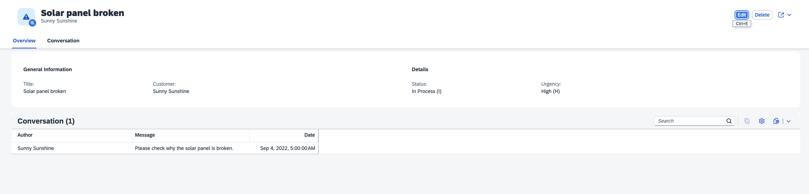
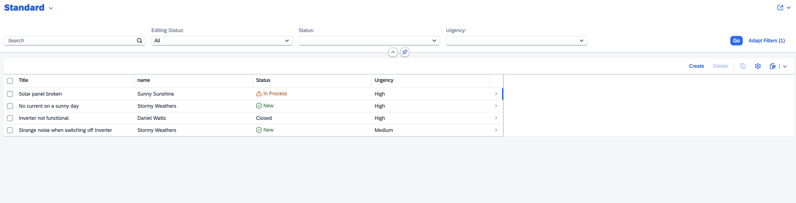

# Getting Started

It contains these folders and files, following our recommended project layout:

File or Folder | Purpose
---------|----------
`app/` | content for UI frontends goes here
`db/` | your domain models and data go here
`srv/` | your service models and code go here
`package.json` | project metadata and configuration

# Overview
This document describes the OData services provided by the ProcessorService and AdminService in the CDS (Core Data Services) model. These services are used for managing incidents and customers in a support and administrative context.

# Services

## ProcessorService

The ProcessorService is designed for support personnel, specifically the processors of incidents. It provides read-only access to incidents and customers.

- Entities:
    - Incidents: A projection on the my.Incidents entity.
    - Customers: A read-only projection on the my.Customers entity.

- Annotations:
    - `@odata.draft.enabled`: Enables draft handling for the Incidents entity.
    - `@(requires: 'support')`: Restricts access to users with the 'support' role.

### Example Usage
- Get Incidents: `GET /ProcessorService/Incidents`
- Get Customers: `GET /ProcessorService/Customers`

### AdminService
The AdminService is intended for administrators to manage both customers and incidents. It provides full access to these entities.

- Entities:
    - Customers: A projection on the my.Customers entity.
    - Incidents: A projection on the my.Incidents entity.

- Annotations:
    - @(requires: 'admin'): Restricts access to users with the 'admin' role.

### Example Usage
- Get Customers: `GET /ProcessorService/Incidents`
- Get Incidents: `GET /ProcessorService/Customers`

# Security

Access to the services is controlled via annotations:

- ProcessorService requires the 'support' role.
- AdminService requires the 'admin' role.

# Draft Handling
The ProcessorService.Incidents entity supports draft handling, allowing for the creation and modification of drafts before finalizing the data.

# Frontend 

